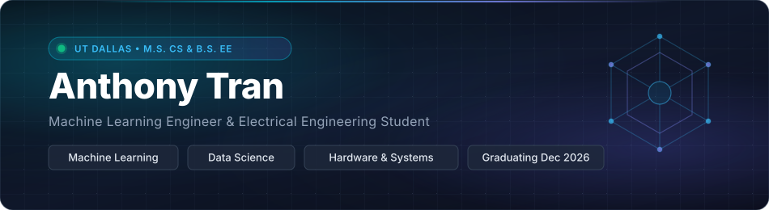

 

&nbsp;&nbsp;
&nbsp;&nbsp;

 

### About

I am a graduate student pursuing an **M.S. in Computer Science at The University of Texas at Dallas** *(Graduating Dec 2026)*, specializing in **Machine Learning**, **Data Science**, and **Intelligent Software Systems**.

* **Current Focus:** Developing RAG architectures, LLM-powered developer tooling, and production ML pipelines.
* **Background:** Built enterprise customer data solutions that reduced workflow overhead by 40%, engineered predictive recommendation models serving 10k+ users, and led technical workshops mentoring 100+ students in cloud and AI fundamentals.
* **Currently Exploring:** Agentic workflows, distributed inference, and high-throughput data processing systems.
* **Open To:** Data Science, Machine Learning Engineering, and Full-Stack AI Software roles.

---

### Technologies & Frameworks

#### Core Languages

 

#### Machine Learning & Cloud

 

#### Backend, Web & Analytics

 

---

### Featured Work

<table>
  <tr>
    <td width="50%" valign="top">
      <h4><a href="https://anthonytranportfolio.me/">Intelligent Python Assistant</a></h4>
      
A RAG-powered developer assistant providing grounded code completions and real-time contextual debugging directly from Python 3.13 documentation.

      

        
        
        
        
      

    </td>
    <td width="50%" valign="top">
      <h4><a href="https://github.com/hxt200010/DiscordBot">Discord AI Bot</a></h4>
      
A community platform bot featuring 100+ slash commands, dynamic role progression, and embedded machine learning modules serving 500+ active users.

      

        
        
        
        
      

    </td>
  </tr>
  <tr>
    <td width="50%" valign="top">
      <h4><a href="https://anthonytranportfolio.me/">Predictive Recommender System</a></h4>
      
Personalized recommendation engine leveraging gradient-boosted ensemble models for tailored ranking and dynamic content filtering across 10,000+ users.

      

        
        
        
        
      

    </td>
    <td width="50%" valign="top">
      <h4><a href="https://anthonytranportfolio.me/">Interactive Developer Portfolio</a></h4>
      
Modern personal showcase featuring machine learning case studies, dynamic data analytics dashboards, and production software projects.

      

        
        
        
        
      

    </td>
  </tr>
</table>

---

### Beyond the Terminal

When I'm not training models or architecting backend services:
* Strength training and active fitness
* Strategic gaming and chess
* Audio production and lofi playlists
* Reading research on distributed machine learning and autonomous systems

---

  Feel free to connect for collaborations, opportunities, or engineering discussions.

